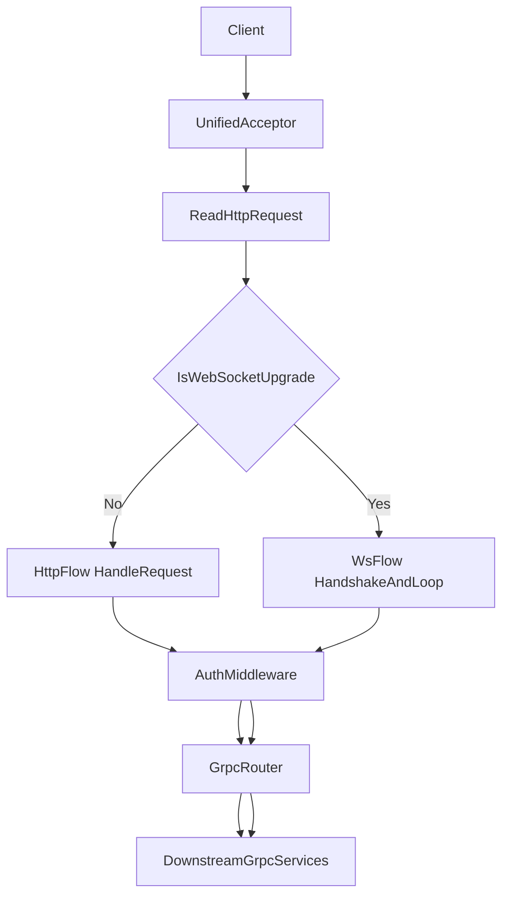

# access_gateway 同端口改造设计

> 状态：已按本文档完成核心落地，可作为实现说明与后续优化基线。

## 目标与边界

- 目标：将 `access_gateway` 从“HTTP/WS 双端口双监听”收敛为“同端口统一监听”。
- 方案：同一 listener 接入后，基于 `websocket::is_upgrade(req)` 分流 HTTP 与 WS。
- 鉴权：采用最佳路径，WS 仅使用握手 `Authorization`，不保留消息体 `auth_token` 兼容逻辑。
- 本文档记录已落地方案与验证口径，作为后续优化基线。

## 改造前基线（历史）

- 启动方式：`main` 同时启动 `HttpServer` 与 `WsServer`。
- 端口配置：`http_port` 与 `ws_port` 分离。
- 线程模型：两套服务都采用 `1 accept io_context + N worker io_context`。
- WS 鉴权：当前消息处理路径允许从消息体读取 `auth_token`。

## 目标架构

### 统一入口分流

1. 接入连接并读取 HTTP request。
2. 判断 `websocket::is_upgrade(req)`：
   - 否：按 HTTP 路径处理并返回响应。
   - 是：执行 WS `async_accept(req)`，进入 WS 消息循环。

### 线程模型（保持不变）

- 保持 `1 accept + N worker` 模型不变，避免一次重构叠加线程模型变化。
- 变化点仅在“协议分流位置”：从“双 server 两套 accept”变为“单 server 内部分流”。

### WS 鉴权策略（目标态）

- 鉴权入口：握手阶段 `Authorization` 头。
- 运行期消息：不再承载 `auth_token`。
- 失败语义：握手鉴权失败时拒绝建立 WS 会话。

## 已改动范围（已落地）

### 配置与入口

- `common/include/common/config/app_config.h`
- `common/config/app_config.cpp`
- `config/access_gateway.yaml`
- `gateways/access_gateway/main.cpp`

### 网关实现

- `gateways/access_gateway/http/http_server.h/.cpp`（新增 upgrade 分流与 WS 会话处理）
- `gateways/access_gateway/ws/ws_server.h/.cpp`（已下线，逻辑收敛到 `http_server`）
- `gateways/access_gateway/auth/auth_middleware.h/.cpp`
- `gateways/access_gateway/routing/grpc_router.h/.cpp`

### 测试与基准

- `tests/integration/gateway_test.cpp`
- `tests/integration/gateway_async_test.cpp`
- `bench/gateway_http_ws_bench.cpp`
- `scripts/bench/run_http_ws_bench.sh`
- `docs/gateway-benchmark.md`

### 部署与发布

- `deploy/docker/docker-compose.yml`
- `deploy/k8s/configmap.yaml`
- `deploy/k8s/access_gateway.yaml`
- `deploy/helm/values.yaml`
- `deploy/helm/templates/configmap.yaml`
- `deploy/helm/templates/service.yaml`

## 实施步骤（建议顺序）

1. **配置收敛**：定义单端口配置表达，明确旧字段迁移策略。
2. **入口收敛**：`main` 切换为单 listener 启动路径。
3. **监听分流**：在统一会话入口实现 HTTP/WS upgrade 分流。
4. **鉴权收口**：WS 切换为握手鉴权，不再解析消息体 `auth_token`。
5. **测试升级**：新增同端口混合流量用例，回归 HTTP/WS 功能与错误语义。
6. **基准更新**：补充同端口下 HTTP/WS 混合压测口径。
7. **部署更新**：K8S/Helm/Docker 改为单端口暴露并联调验证。

## 回归验证清单

- 功能：
  - HTTP 端点（`/health`、`/ready`、`/metrics`、`/admin/*`、业务路由）可用。
  - WS 握手鉴权成功/失败路径符合预期。
- 稳定性：
  - 同端口下 HTTP 短连接与 WS 长连接混合并发稳定。
  - 连接关闭、超时、异常路径无明显资源泄漏。
- 性能：
  - 对比双端口基线的 QPS、P95/P99、错误率。
- 发布：
  - K8S Service/Ingress（含 WS Upgrade）与 Docker 映射正常。

## 风险与回滚

- 风险：
  - HTTP/WS 混跑会带来资源竞争，尾延迟可能上升。
  - 握手鉴权收口后，客户端必须同步发送 `Authorization`。
  - 部署层若遗漏端口变更，容易出现环境不一致。
- 回滚：
  - 当前仓库不再保留双端口运行路径，若需回退请基于历史提交或分支恢复。
  - 回滚前需同步恢复配置模板、部署端口暴露和回归用例口径。
  - 基于 benchmark 与错误率阈值决定是否继续放量。

## 关联文档

- `access-gateway-architecture.md`
- `../gateway-async-roadmap.md`
- `../gateway-benchmark.md`
- `../agent-quickstart.md`
